Ở các bài trước, chúng ta đã biết về quy trình làm việc để tạo ra một chương trình C++, những công cụ cần thiết và IDE mà chúng ta sẽ sử dụng để phát triển chương trình. Đến đây chắc các bạn cũng đang háo hức muốn bắt tay vào viết một cái gì đó. Trong bài này, chúng ta sẽ cùng viết một chương trình mà bất cứ lập trình viên C++ nào cũng từng trải qua. Một chương trình huyền thoại mang tên **"Hello World".**

Để bắt đầu viết chương trình, chúng ta cùng mở IDE Visual studio 2015 lên và tạo một project. Tại giao diện **Start Page** của Visual studio, các bạn click chọn **New Project.**

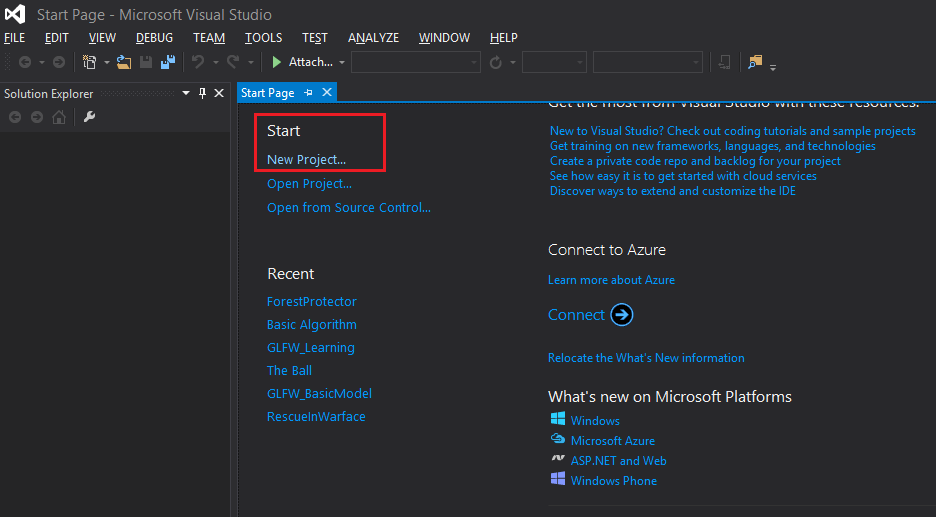


Cửa sổ tạo project mới hiện ra, các bạn chọn **Empty project**, đặt tên cho project là **HelloWorld.** Sau đó, ở phần location các bạn có thể chọn đường dẫn thư mục để lưu project này vào.

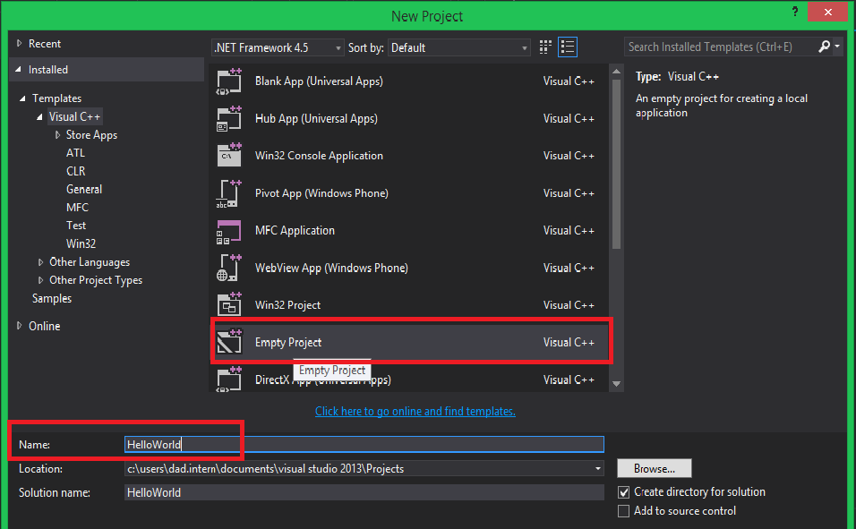


Nhấn chọn OK để hoàn tất việc tạo project mới. Ngay khi Visual studio thiết lập project bạn vừa tạo. Bạn có thể nhìn vào cửa sổ **Solution Explorer** (mặc định là bên trái) để xem cấu trúc tổ chức của một project như thế nào.

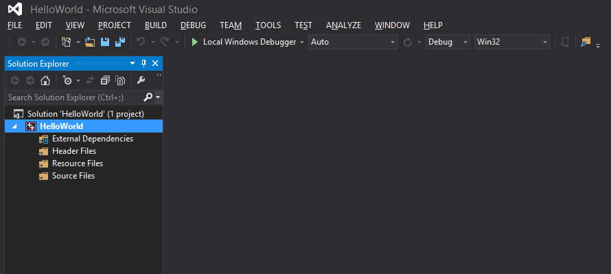


Project **HelloWorld** được Visual studio tổ chức dưới dạng cây thư mục để quản lý mã nguồn và tài nguyên. 

Trong project **HelloWorld**, hiện tại chúng ta quan tâm đến 2 phần chính:

+ Header Files: dùng để chứa các phần khai báo class, khai báo hàm hoặc phần khai báo một số hằng số được sử dụng cho chương trình. Các file được chứa trong phần Header thường có phần đuôi mở rộng là .h, .hpp.
+ Source Files: là nơi chứa các file định nghĩa các hàm, các class... Các file được đặt trong này thường có dạng .cpp.

Bây giờ chúng ta cùng tạo file chương trình đầu tiên. Các bạn click chuột phải vào tên project ở trong khung **Solution Explorer**, chọn đến dòng **Add** và click chọn **New Item**...

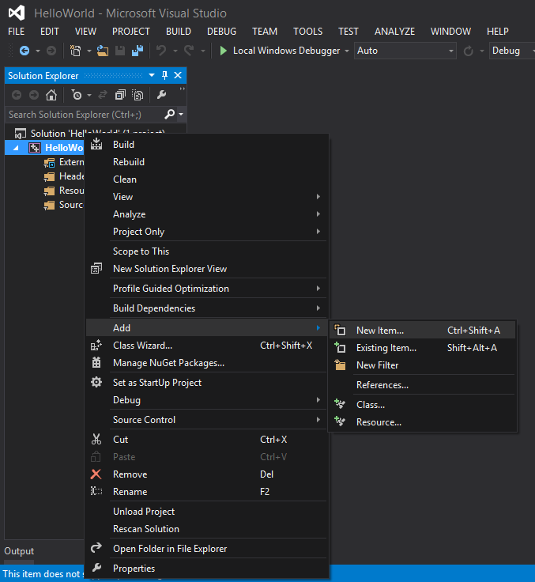

Trong cửa sổ **Add New Item**, các bạn chọn loại file cần thêm là C++ File (.cpp), đặt tên file ở textbox Name phía bên dưới. Để tạo một thói quen tốt, file này các bạn đặt tên là main.cpp sau đó click **Add**.

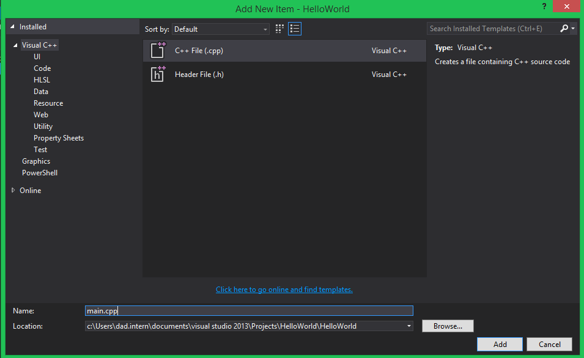

Sau khi add file main.cpp xong, cùng nhìn lại phần tổ chức project trong cửa số **Solution Explorer** xem điều gì đang xảy ra. 

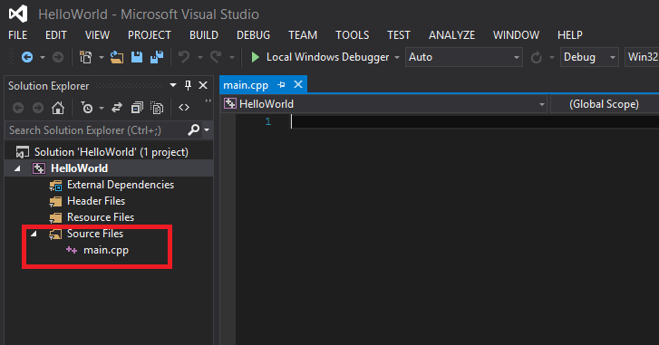

Chúng ta đã có thêm 1 file được đặt sẵn trong phần Source Files. Một file có đuôi mở rộng là .cpp luôn được đặt trong phần này. Phía bên phải là phần soạn thảo mã nguồn cho file main.cpp đã được mở sẵn. Như đã nói ở trên, file đầu tiên cần tạo cho project nên đặt tên là main.cpp để tạo một thói quen tốt, chắc các bạn sẽ thắc mắc và đặt câu hỏi tại sao? 

Trước hết, chúng ta cùng viết một ít mã lệnh cho **HelloWorld** program.

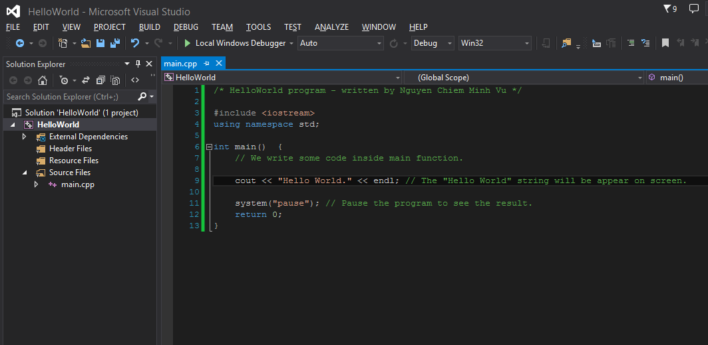

Nhấn tổ hợp phím Ctrl + S để lưu lại những gì bạn đã viết. Ở mức độ hiện tại, mình chỉ yêu cầu các bạn viết theo những gì mình đã viết, chưa yêu cầu các bạn phải hiểu được những dòng mã trên có ý nghĩa gì. Sau khi lưu file main.cpp lại, chúng ta đã có được file mã nguồn C++ đầu tiên. Các bạn có thể muốn xem thử file main.cpp vừa được lưu đang nằm chổ nào. Để xem thư mục gốc của project, các bạn click chuột phải vào tên project HelloWorld trong cửa sổ **Solution Explorer** rồi chọn Open Folder in **File Explorer**.

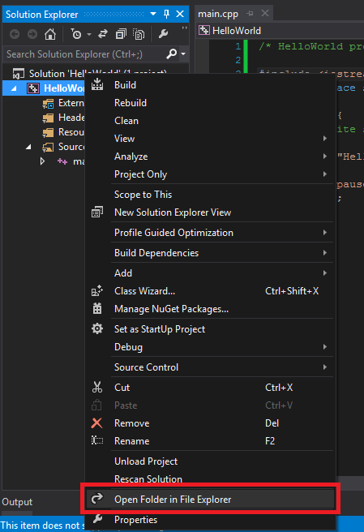

Và chúng ta thấy file main.cpp như trong hình bên dưới.


Quay lại với màn hình làm việc của Visual studio. Các bạn click chuột vào menu item BUILD trên Tool bar, sau đó chọn Build Solution (hoặc nhấn phím F7).

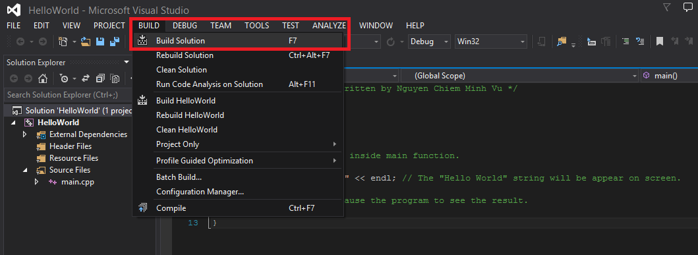

Thực hiện bước này, Visual studio sẽ biên dịch file main.cpp của bạn để tạo thành file object .obj, đồng thời liên kết file main.obj tạo thành file chương trình (có đuôi .exe). Chúng ta chuyển qua thư mục gốc của project chứa file main.cpp lúc nãy, double click vào thư mục Debug, chúng ta thấy file main.obj là kết quả của quá trình biên dịch mã nguồn.


Quay lui thư mục chứa file main.cpp ban đầu, cùng chuyển lui một thư mục ngoài nữa. Chúng ta lại thấy một thư mục có tên là Debug khác.


Vào trong thư mục Debug này, các bạn sẽ thấy file .exe đã được Visual studio tạo ra.


Bây giờ, các bạn mở file HelloWorld.exe này bằng cách double click vào nó. Cùng xem kết quả xuất hiện trên màn hình.

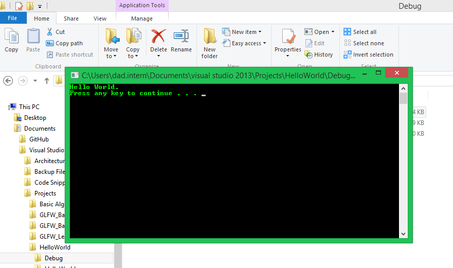

Như các bạn thấy, trong cửa số Console, chúng ta có một dòng chữ xuất hiện: "Hello World.", và một dòng gợi ý cho người dùng rằng: Hãy nhấn 1 phím bất kì để kết thúc chương trình.

Ngoài cách chạy trực tiếp file HelloWorld.exe trong thư mục Debug, các bạn còn có thể chạy chương trình ngay trên màn hình làm việc của Visual studio, bằng cách click chuột phải vào tên project trong cửa sổ Solution Explorer -> Debug -> Start new instance.

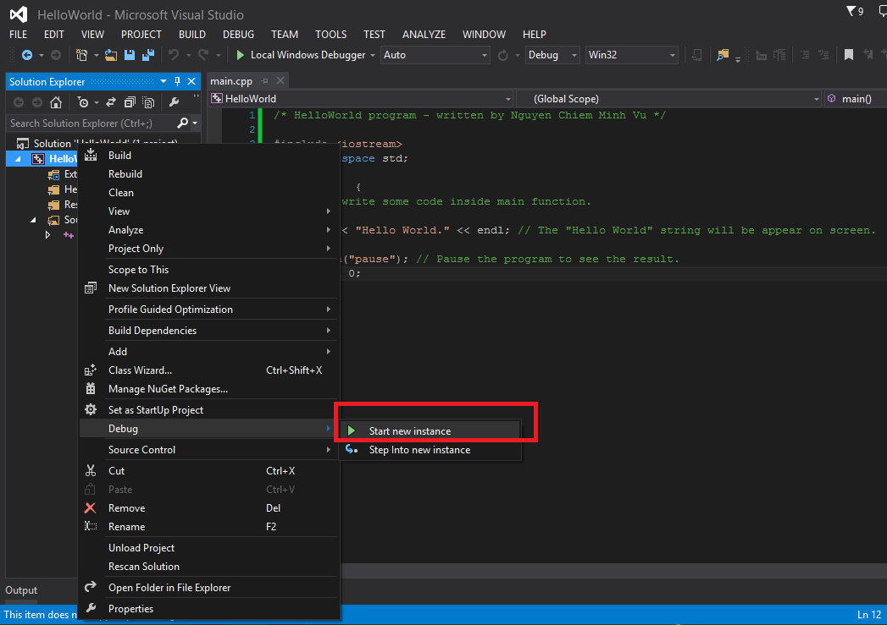

Và ta được kết quả tương tự khi chạy trực tiếp file HelloWorld.exe

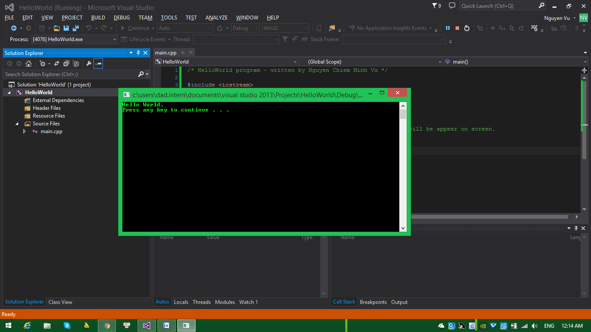

Vậy là chúng ta đã viết xong chương trình đầu tiên của khóa học lập trình C++. Bây giờ mình muốn quay lại vấn đề mình đã nói ở trên, đó là tại sao chúng ta lại nên đặt tên file đầu tiên cho project là main.cpp?

Để giải thích vấn đề này, mình muốn các bạn nhìn lại mã nguồn của file main.cpp mà các bạn đã viết cùng mình để có cái nhìn tổng quan về cấu trúc của một chương trình C++ cơ bản.

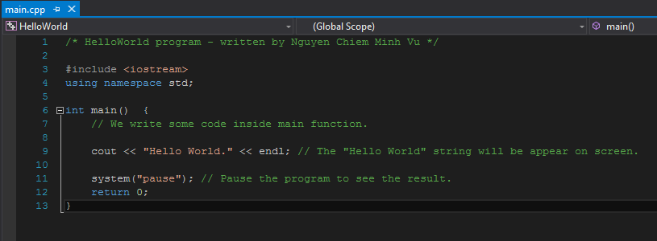


Các bạn hãy chú ý đến dòng 6 trong chương trình trên. Chúng ta thấy 

```
int main()
```

Đó là dòng bắt buộc phải có nếu muốn mã nguồn C++ có thể hoạt động được. Main trong tiếng Anh khi dịch ra có nghĩa là chính, quan trọng. Trong ngôn ngữ C++, main là điểm khởi đầu cho một chương trình. Trong một thời điểm, máy tính của chúng ta chỉ có thể thực hiện 1 dòng lệnh. Và ở thời điểm chương trình C++ bắt đầu chạy, nó sẽ tìm tới nơi có khai báo là main để thực hiện mã lệnh ở trong đó.
Mã lệnh mà chương trình thực hiện sẽ được đặt trong cặp ngoặc nhọn { và }.
Vì thế, cấu trúc chương trình C++ mà bạn cần nhớ sẽ như bên dưới.


	Các bạn cần lưu ý, một chương trình C++ chỉ có duy nhất một hàm main.

	Các bạn sẽ thấy nhiều hàm main có cách khai báo khác nhau. Nhưng với việc

	bạn là người mới bắt đầu học C++, mình khuyến nghị các bạn nên sử dụng theo

	cách trong hình trên.

	int main()
	{

	}

Chương trình của C++ sẽ thực hiện từng dòng lệnh trong cặp ngoặc nhọn { } ở phía sau hàm main một cách **có thứ tự** từ trên xuống dưới. 

Một chương trình C++ bắt buộc phải có 1 hàm main, thế nên mình khuyên các bạn nên đặt tên file đầu tiên trong chương trình main.cpp, và file này sẽ chứa mã nguồn C++ có hàm main ở trong đó, sau này các bạn làm việc với 1 dự án có nhiều file thì sẽ không bị nhầm lẫn.


Ở bài học kế tiếp (trong chương tiếp theo), mình sẽ nói về cấu trúc của một chương trình C++ cơ bản. Hẹn gặp lại các bạn trong bài học sau.