Chúng ta tiếp tục đồng hành trong khóa học lập trình C++ hướng thực hành. 

Trong bài học hôm nay, chúng ta sẽ tìm hiểu cơ bản về việc lưu trữ và sử dụng dữ liệu.

Như thường lệ, việc đầu tiên chúng ta làm là tạo một project C++ mới (Mình đặt tên project là Bai1.4 để tiện theo dõi, còn các bạn thích đặt tên project là gì cũng được).

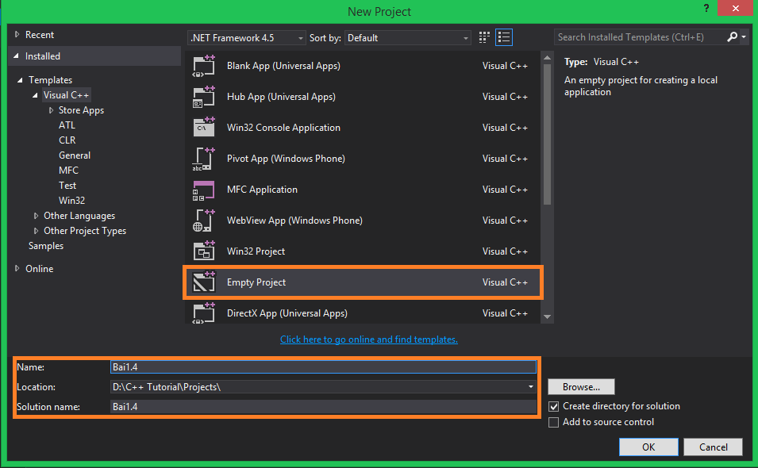

Sau khi Visual studio thiết lập cấu hình cho project, ta tạo file main.cpp và viết một số dòng lệnh tạo nên cấu trúc cơ bản của chương trình C++.

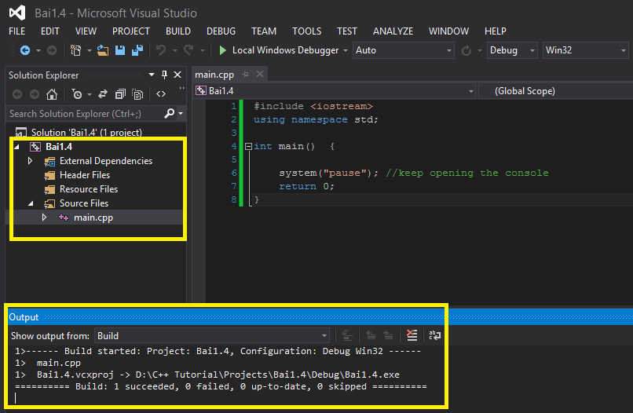

Sau đó nhấn tổ hợp phím **Ctrl + Shift + B** để thực hiện quá trình biên dịch file main.cpp thành file main.obj, và tạo thành file execute. Việc build chương trình trong giai đoạn đầu này nhằm đảm bảo mọi thứ hoạt động ổn định, và tiết kiệm thời gian cho những lần build sau.

Mình xin phép dành thêm một ít thời gian để nói về cấu hình build ứng dụng của Visual studio 2015.

Khi thực hiện build project, Visual studio cung cấp cho chúng ta hai lựa chọn: **Debug** và **Release**.

Để chọn cấu hình build ứng dụng, các bạn vào **BUILD** trên thanh Menu Bar, chọn **Configuration Manager**.


Cửa sổ chọn cấu hình xuất hiện như bên dưới:

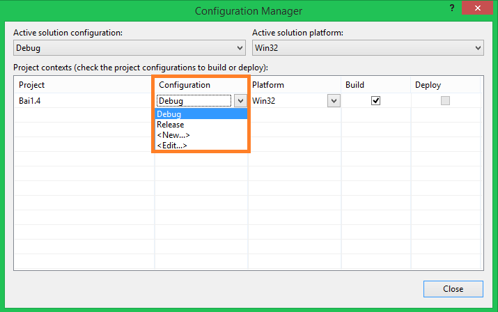

Hai lựa chọn này khác nhau như thế nào? Có thể hiểu  build chương trình dưới cấu hình **Debug** thì sản phẩm của chúng chưa được hoàn thiện, cần thời gian để tìm lỗi, sửa lỗi... Và một khi bạn cho rằng sản phẩm của mình đã được viết hoàn tất, bạn chuyển sang cấu hình **Release** để build sản phẩm. Sản phẩm sau khi **Release** thường sẽ có dung lượng nhẹ hơn khi **Debug**, vì khi trong chế độ **Debug**, Visual studio sẽ tích hợp một số thư viện nhằm phục vụ cho quá trình tìm kiếm và sửa lỗi. Đây chỉ là phần ngoài lề của bài học, bây giờ chúng ta quay lại với nội dung chính.

##Biến (Variable)

Khái niệm **biến** (variable) ra đời đã giải quyết được rất nhiều mặt hạn chế trong các chương trình mà các bạn đã viết trong các bài học trước. Ví dụ với chương trình tính kết quả biểu thức chứa 2 số nguyên, các bạn phải viết một vài dòng lệnh, biên dịch chương trình, chạy chương trình để in ra kết quả. Sau đó thì sao? Khi bạn muốn tính kết quả của phép tính trên với 2 giá trị khác, các bạn lại phải viết lại một vài dòng lệnh, và thực hiện quá trình trên lặp đi lặp lại.

Đây không phải là lập trình! Người viết chương trình phải đảm bảo chương trình sau khi viết ra phải có tính tổng quát, nghĩa là chương trình đó phải giải được một bài toán nào đó với nhiều giá trị đầu vào khác nhau mà không phải thay đổi bất kỳ đoạn code nào bên trong.

Để tiết kiệm thời gian cho việc này, chúng ta sẽ sử dụng **biến** (variable) để lưu trữ giá trị cần xử lý.

Ví dụ:

	int var1 = 3;
	int var2 = 5;
	cout << "var1 + var2 = " << var1 + var2 << endl;

Trong đoạn code trên, var1 là một biến và var2 cũng là một biến. Hai biến này hiện đang lưu trữ hai giá trị khác nhau (cũng có thể sẽ trùng nhau). Và dòng lệnh **cout** bên dưới sẽ in ra kết quả phép cộng của hai biến này.

Và khi chúng ta muốn thay đổi giá trị của hai số cần tính, chúng ta đơn giản truyền vào cho hai biến này hai giá trị khác.

	var1 = 10;
	var2 = 20;
	cout << "The new result: " << var1 * var2 << endl;

Như đoạn code trên, chúng ta sử dụng lại hai biến var1 và var2 mà không cần biên dịch lại chương trình hay viết lại bất kỳ đoạn code nào. Việc tái sử dụng tiết kiệm thời gian và công sức cho chúng ta rất nhiều.

Đến đây sẽ có nhiều bạn vẫn chưa hình dung được **biến** là cái gì. Các bạn có thể hiểu như thế này: 

Biến là một ô nhớ đơn lẻ hoặc một vùng nhớ được hệ điều hành cấp phát cho chương trình C++ nhằm để lưu trữ giá trị vào bên trong vùng nhớ đó. Chúng ta sẽ hỏi xin hệ điều hành những vùng nhớ thông qua các câu lệnh khai báo biến như bên dưới:

	int valueInteger = 12; // (1) Chúng ta có một vùng nhớ để chứa 1 số nguyên

	float valueFloat = 5.394; // (2) Xin hệ điều hành thêm một vùng nhớ để chứa 1 số thực

	string myName = "Minh Vu"; // (3) Biến này chứa được một dãy các kí tự


Với 3 cách khai báo trên, chúng ta sẽ có 3 vùng nhớ nằm ở 3 vị trí khác nhau trên RAM của bạn.

Với cách khai báo 1:

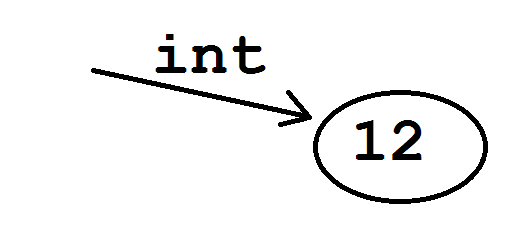

Với cách khai báo 2:

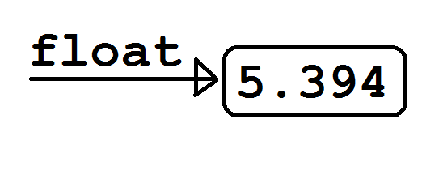

Với cách khai báo 3:

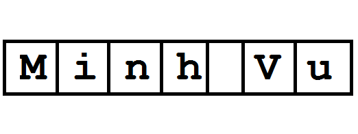

Sau đây là cú pháp cơ bản để chúng ta khai báo 1 biến:

	<Kiểu dữ liệu> <Tên biến> = [Giá trị khởi tạo của biến];
		

Trong đó, tên biến giúp ngôn ngữ C++ xác định vùng nhớ mà chúng ta đã cấp phát, mỗi lần sử dụng biến, compiler sẽ tìm đến vùng nhớ mà chúng ta đã đặt tên cho nó và lấy giá trị ra để sử dụng. Kiểu dữ liệu sẽ phân loại giá trị của biến (kí tự, số nguyên, số thực, ...), chúng ta sẽ làm rõ hơn ở phần dưới của bài học này.

Khi khai báo biến, chúng ta có thể gắn 1 giá trị ban đầu cho biến hoặc không, nhưng chúng bản chất là một câu lệnh, nên chúng ta phải kết thúc bằng **dấu chấm phẩy**.

Lý thuyết nhiều rồi, bây giờ chúng ta sẽ tận dụng sức mạnh lưu trữ dữ liệu của biến để giải một bài toán cơ bản.

*Bài toán: Nhà mình có nuôi 1 đàn bò, mình đã biết số lượng bò ở thời điểm hiện tại. Nhưng vì mình tính toán chậm nên gặp khó khăn trong việc tính số chân bò của đàn bò đang nuôi. Mình muốn đưa máy tính tính giúp mình, các bạn có thể giúp mình viết chương trình tính tổng số chân bò của cả đàn được không? (Các bạn có thể nghĩ ra một con số đại diện cho số bò mà mình đang nuôi, sao cho nó là số nguyên dương là được)*

Sau khi viết xong đề của bài toán thì mình đã nghĩ ra giải pháp giải quyết bài toán này rồi. Chúng ta biết 1 con bò thì có 4 chân, vậy là mình chỉ cần 1 biến để chứa số bò hiện tại, và lấy giá trị của biến đó nhân với 4 là ra kết quả.

Đây là chương trình do mình viết, mình khuyên các bạn nên tự nghĩ cách viết trước khi tham khảo chương trình của mình.

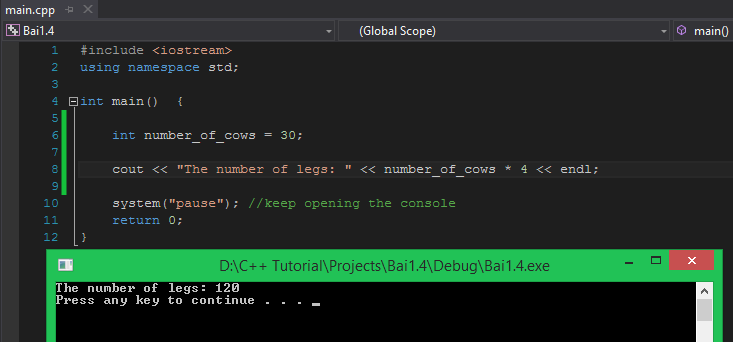

Hi vọng chương trình của bạn các viết cũng cho kết quả đúng như mong đợi.

Bây giờ có một vấn đề phát sinh, đàn bò của mình sau một năm đã sinh thêm 10 con bò con. Bây giờ làm sao để mình tính tổng số chân của đàn bò mới?

**Hướng giải quyết**: Lấy số lượng bò cũ cộng thêm 10 con bò mới sinh, và lấy số lượng bò mới này nhân 4.

Chương trình của mình sẽ được viết lại như sau:

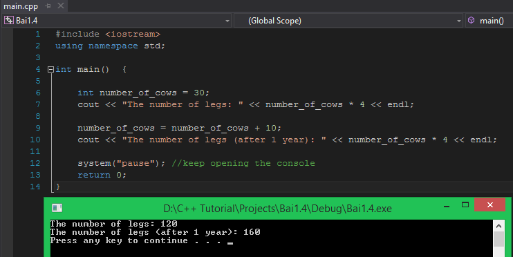

Ở đoạn code trên, dòng ``` number_of_cows = number_of_cows + 10; ``` có nghĩa là:

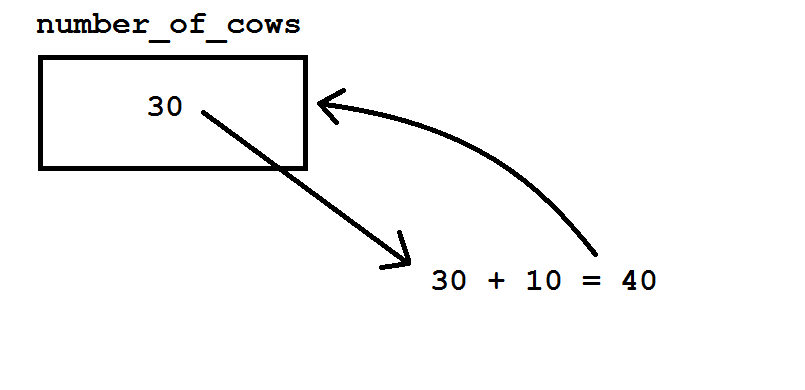

Chúng ta dùng toán tử **"="** để đưa một giá trị vào trong biến number_of_cows, giá trị mà chúng ta đưa vào sẽ bằng giá trị của biến ```number_of_cows``` hiện tại (đang là 30) cộng thêm 10. Sau khi thực hiện dòng lệnh này, giá trị mới trong biến ```number_of_cows``` sẽ là 40.

Chúng ta đã sử dụng lại biến ```number_of_cows``` để tính tiếp số chân bò sau 1 năm mà không cần phải viết lại chương trình tính số chân bò nữa.

##Kiểu dữ liệu

Kiểu dữ liệu là một thành phần bắt buộc phải có khi muốn khai báo biến, nó giúp chương trình xác định kích cỡ của vùng nhớ mà bạn muốn xin hệ điều hành cấp phát trên RAM, đồng thời giúp chương trình xác định giới hạn giá trị mà biến đó có thể lưu trữ.

Dưới đây là bảng mô tả một số kiểu dữ liệu cơ bản:

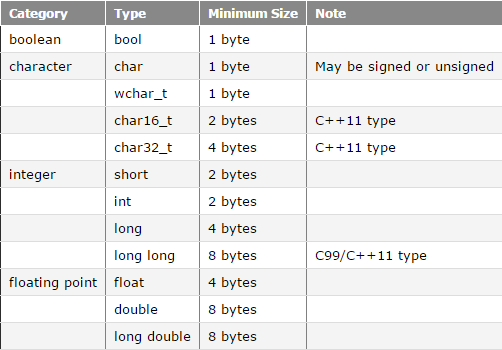

(Nguồn: www.learncpp.com)

Trong cột Category, người ta chia các kiểu dữ liệu cơ bản thành 4 loại:

- Kiểu logic (boolean): **bool**.
- Kiểu kí tự (character): **char**, wchar_t, char16_t, char32_t. Hiện tại chúng ta chỉ cần quan tâm đến kiểu **char**.
- Kiểu số nguyên (integer): short, **int**, long, long long. Thường dùng nhất là kiểu **int**.
- Kiểu số thực (floating): **float**, **double**, long double. Tùy vào độ chính xác mà chúng ta đòi hỏi ở phần thập phân mà chúng ta chọn kiểu dữ liệu **float** hoặc **double**. Kiểu double có kích thước vùng nhớ lớn hơn, nên sẽ lưu giá trị có độ chính xác cao hơn **float**.

Kích thước vùng nhớ của các kiểu dữ liệu này được tính bằng đơn vị **byte**. Đối với các bạn mới học ngôn ngữ lập trình, chúng ta chưa cần quan tâm nhiều đến khái niệm này.

Để xem kích thước vùng nhớ sẽ được cấp phát cho biến trong chương trình. Chúng ta sử dụng toán tử **sizeof(<kiểu dữ liệu>)** như sau:

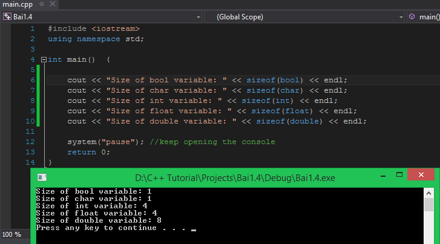

Theo kết quả của chương trình, kiểu dữ liệu số nguyên **int** có kích cỡ 4 **bytes**, đó là do IDE Visual studio 2015 định nghĩa kiểu **int** như vậy. Mỗi compiler sẽ có một chuẩn kiểu dữ liệu riêng, nên các bạn không cần lo lắng về sự khác biệt giữa kích bảng dữ liệu ở trên với kết quả thực tế.

Các bạn hiện tại chỉ cần hiểu với những kiểu dữ liệu có kích thước càng lớn thì phạm vi giá trị có thể lưu trữ cho biến càng lớn.

Dưới đây là bảng giới hạn giá trị cho từng kiểu dữ liệu mà chúng ta thường xuyên sử dụng trong Visual studio:


Các bạn không cần nhớ chính xác những giới hạn trên, chỉ cần ước chừng phạm vi của mỗi kiểu dữ liệu để chọn kiểu dữ liệu phù hợp cho biến là được.

##Tổng kết

Trong bài này, các bạn chỉ cần hiểu được một số khái niệm về biến và kiểu dữ liệu:

- Biến (variable) là một đối tượng chiếm giữ một vùng nhớ xác định.
- Biến (variable) dùng để lưu trữ giá trị (kí tự, số nguyên, số thực ... hoặc cũng có thể là một dãy các con số).
- Cú pháp khai báo biến:
	```
	<kiểu dữ liệu> <tên biến> [= giá trị khởi tạo];
	```
- Kiểu dữ liệu đứng trước tên biến nhằm xác định giới hạn giá trị mà biến có thể lưu trữ được.
- Đặt tên biến như thế nào cho phù hợp?

	+ Tên biến không được bắt đầu bằng kí tự số.
	+ Trong một khối lệnh { } không được có hai biến cùng tên.
	+ Tên biến trong C++ phân biệt chữ hoa và chữ thường. Ví dụ: ```int var1;``` và ```int Var1;``` là hai biến phân biệt.
	+ Các bạn có thể sử dụng kí tự gạch chân khi đặt tên biến.
	+ Nên đặt tên biến sao cho thể hiện được ý nghĩa của biến. Ví dụ: 
	 
		```int myAge;```

		```string myName; // các bạn sẽ được học về kiểu string trong các bài học sau```
		
		```bool isRunning = true;```

		```int current_score;```

- Khi sử dụng biến trong các biểu thức toán học, các bạn nên dùng biến có cùng kiểu dữ liệu với nhau. (Tùy trường hợp mà có thể dùng kết hợp nhiều kiểu dữ liệu khác nhau)


###Bài tập cơ bản


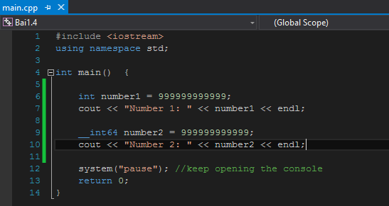

1. Chạy thử đoạn chương trình trên và xem kết quả.
Giải thích tại sao chương trình cho kết quả như vậy!

2. Tạo hai biến (variable) và gán giá trị mặc định cho nó tùy ý bạn, sau đó in ra kết quả của 4 phép toán cơ bản +, -, * và / của hai biến đó lên màn hình.

3. Viết chương trình tính chu vi và diện tích hình chữ nhật khi biết trước độ dài hai cạnh kề nhau.


**Hẹn gặp lại các bạn trong bài học tiếp theo trong khóa học lập trình C++ hướng thực hành.**

Mọi ý kiến đóng góp hoặc thắc mắc có thể đặt câu hỏi trực tiếp tại diễn đàn 

**www.daynhauhoc.com**
