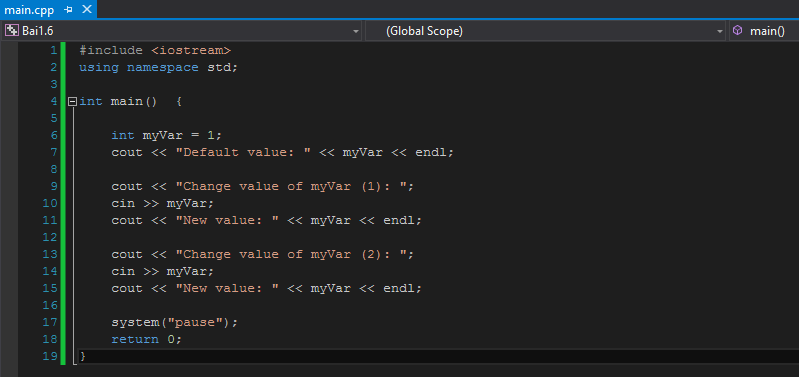
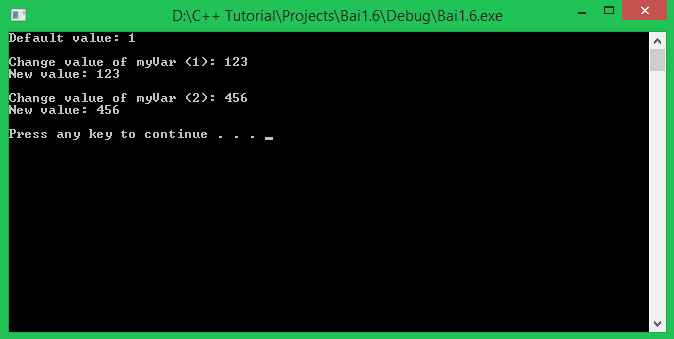
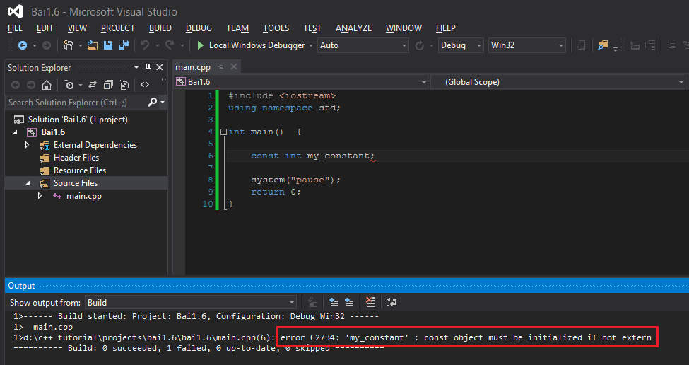
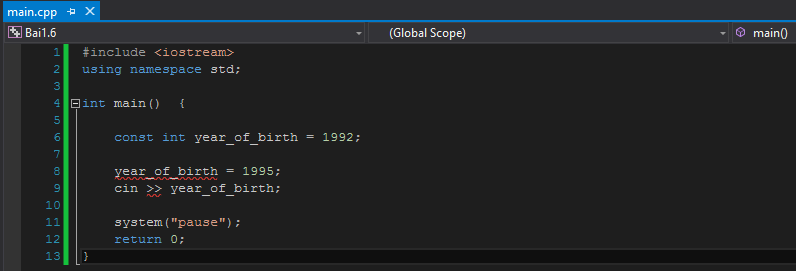

Chào các bạn! Chúng ta lại gặp nhau trong khóa học lập trình C++ hướng thực hành!

Trong bài học trước, chúng ta đã biết cách sử dụng **Starndard Input** trong C++ để nhập giá trị từ bàn phím và đưa vào vùng nhớ mà tên biến đang quản lý. Mỗi lần sử dụng đối tượng **cin** để nhập dữ liệu vào biến, giá trị trong vùng nhớ của biến đó sẽ bị thay đổi 1 lần. Đối với một số biến có cách khai báo thông thường, **compiler** cho phép ta thực hiện thay đổi giá trị của biến không giới hạn số lần.

Ví dụ:



Trong đoạn chương trình trên, biến **myVar** được khởi tạo giá trị ban đầu là 1. Và mình đã sử dụng 2 lần đối tượng **cin** để nhập giá trị mới cho biến **myVar**



Trong một số bài toán, giá trị của biến cần được thay đổi nhiều lần. Bên cạnh đó, có một số giá trị chúng ta muốn khởi tạo một lần và giữ nguyên giá trị đó trong suốt thời gian chương trình hoạt động. Ví dụ: 

```PI = 3.14;```  
```gravity_on_earth = 9.8;```

**Những giá trị này được gọi là hằng số.**

Việc định nghĩa một biến trong C++ như một hằng số sẽ giúp bạn đảm bảo giá trị của biến đó không bị thay đổi ngoài ý muốn.

###Khai báo hằng số

Để khiến một biến trong C++ trở thành một hằng số, bạn chỉ cần đặt *từ khóa* **const** trước hoặc sau kiểu dữ liệu của biến. Ví dụ:

```const float gravity = 9.8;```

```int const my_constant = 123;```

*Lưu ý: Bạn phải khởi tạo giá trị cho biến hằng số mỗi khi định nghĩa chúng.*

Định nghĩa một hằng số không có giá trị khởi tạo sẽ phát sinh lỗi khi biên dịch chương trình.



Các bạn có thể dùng giá trị của một biến không phải là hằng số để khởi tạo giá trị cho một biến hằng số.


	int non_const_variable = 10;
	const int const_variable = non_const_variable;

Một khi từ khóa **const** đã được sử dụng cho một biến, mọi hành vi khiến giá trị biến đó bị thay đổi đều bị **compiler** báo lỗi. Ngoài ra, bạn có thể sử dụng biến hằng số để tính toán, in giá trị của biến hằng số ra màn hình, ... sử dụng như một biến thông thường.



###Một số cách để khởi tạo giá trị cho biến

Như mình đã nói ở trên:

>Một biến hằng số phải được khởi tạo giá trị sau khi định nghĩa.

Việc khởi tạo giá trị có thể được viết bằng nhiều cách khác nhau. Ví dụ mình có biến **year_of_birth** có kiểu **int**, mình có thể khởi tạo biến này như sau:

```int year_of_birth = 1992;```

```int year_of_birth(1992);```

```int year_of_birth { 1992 };```

Nhưng theo ý kiến cá nhân của mình, sử dụng toán tử bằng "=" để khởi tạo giá trị khiến chương trình dễ hiểu hơn.

##Tổng kết

Trong bài học này, các bạn đã được biết thêm khái niệm **hằng số**, cách khai báo, định nghĩa và sử dụng hằng số trong ngôn ngữ C++. Ngoài ra, các bạn còn biết thêm một số cách khởi tạo giá trị thông dụng cho biến.

**Hẹn gặp lại các bạn trong bài học tiếp theo trong khóa học lập trình C++ hướng thực hành.**


Mọi ý kiến đóng góp hoặc thắc mắc có thể đặt câu hỏi trực tiếp tại diễn đàn 

**www.daynhauhoc.com**