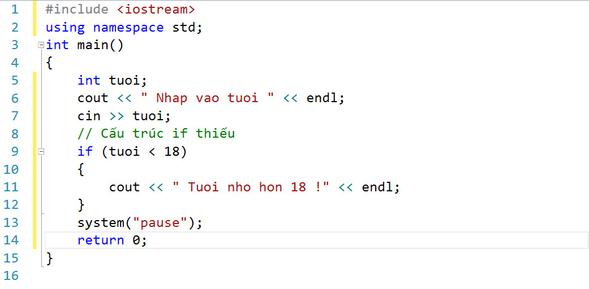
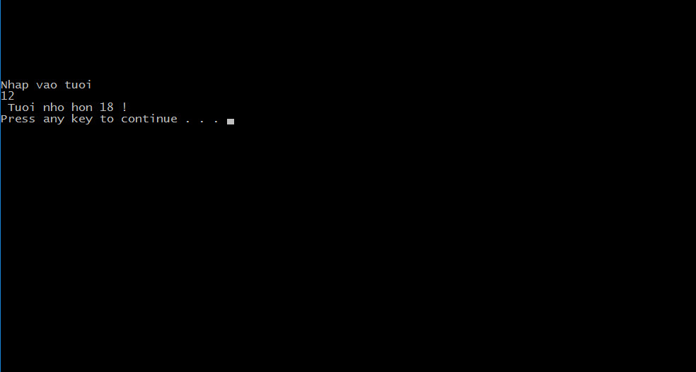

Chào mừng các bạn quay lại với khóa học hướng thực hành ngôn ngữ C++

----------
### Cấu trúc If thiếu

	if (biểu thức điều kiện) 
	{
      câu lệnh ứng với true;
	}
Bắt đầu với từ khóa **if** ngay sau đó **nhận giá trị** của  **biểu thức điều kiện** chỉ trả về một trong hai giá trị true( **khác** 0) hoặc false( 0).
Nếu biểu thức trả về giá trị **true**( giá trị **khác 0**). Thì chương trình sẽ thực hiện **câu lệnh  ngay sau if***( ứng với true)*.

> Tại kiểu dữ liệu Boolean, giá trị 0 được định nghĩa tương đương với **false**. Khác 0 là **true**

	bool b = true ;
		if (b)
	{
	 cout << " b la " << b << endl; 
	}

**Output**

	b la 1
Tại sao vậy ?

Vì trình biên dịch dịch chương trình, nó không hiểu theo true và false. Mà chỉ hiểu giá trị **1** ứng với **true**, **0** ứng với **false**. Vậy khi sử dụng **cout << ** để in ra thì sẽ chỉ có 2 giá trị **1** hoặc **0**. 

Muốn in ra **true** và **false** ta chỉ việc sử dụng **boolalpha**  ngay trước sau cout

 	#include<iostream>
	using namespace std;
	int main(){
		bool b = true ;
			if (b)
			{
			 cout << boolalpha << " b la " << b << endl; 
			}
	}

**Output**

	b la true

Cùng vận dụng lại kiến thức về kiểu dữ liệu Boolean và cách biểu diễn sơ đồ khối ở bài trước. Các bạn sẽ thực hành cùng một số ví dụ như sau : 

* Nhập vào số tuổi, kiểm tra xem tuổi có **< 18** tuổi hay không ? Có thì in ra " tuoi nho hon 18 !"

>Mọi người cùng code rồi debug một vài trường hợp xem như thế nào ?

Đây là kết quả 

>Cấu trúc rẽ nhánh đơn giản đầu tiên là cấu trúc if thiếu có dạng như vậy.Cùng đi phân tích cách hoạt động của nó.

###Từ khóa if
 Bắt đầu một cấu trúc rẽ nhánh với từ khóa **if** ( dịch sang tiếng việt là **nếu**)
### Giá trị biểu thức điều kiện Boolean

Ngay sau **if** có một biểu thức trả về một giá trị khác với giá trị 0 thì biểu thức điều kiện đó đúng. Còn bằng giá trị **0** thì biểu thức điều kiện đó sai.

### Khối lệnh 
Ngay sau biểu thức điều kiện sẽ có **một câu lệnh** hoặc **nhiều câu lệnh**( khối lệnh)
. Chúng ta sẽ thống nhất để các câu lệnh trong cặp **{}**.

> Cùng thử dịch sang tiếng việt. if( nếu) điều kiện đúng -> câu lệnh.
> 
> **Nếu** cái gì đó **đúng** thì **làm** việc gì đó .
> C++ rất là logic phải không ?

Nếu **cái gì đó** không đúng thì sao? Sang bài tiếp chúng ta sẽ cùng tìm hiểu.

----------
Còn đây là một số bài tập cho các bạn thử tập làm.

1. Nhập vào một số nguyên n. 
 *  Kiểm tra xem số đó có lớn hơn bằng 10?
 *  Có khác 50?
 *  Nhỏ hơn bằng 100?
 *  ...

2. Nhập vào tuổi của bạn và ba bạn. Kiểm tra xem tuổi nhập vào của bạn có nhỏ hơn tuổi nhậ vào của ba bạn không ? Nếu có thì in ra ba bạn hơn bạn bao nhiêu tuổi :D

----------
P/s: **Hẹn gặp lại các bạn trong bài học tiếp theo trong khóa học lập trình C++ hướng thực hành.**

Mọi ý kiến đóng góp hoặc thắc mắc có thể đặt câu hỏi trực tiếp tại diễn đàn 

[www.daynhauhoc.com](www.daynhauhoc.com "DayNhauHoc")

